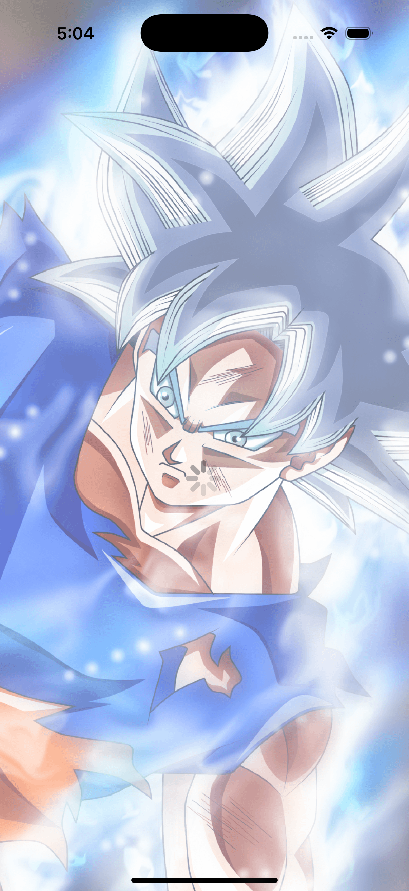
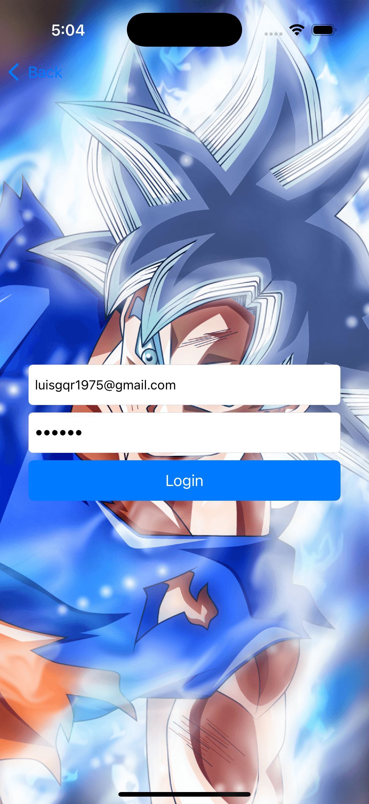
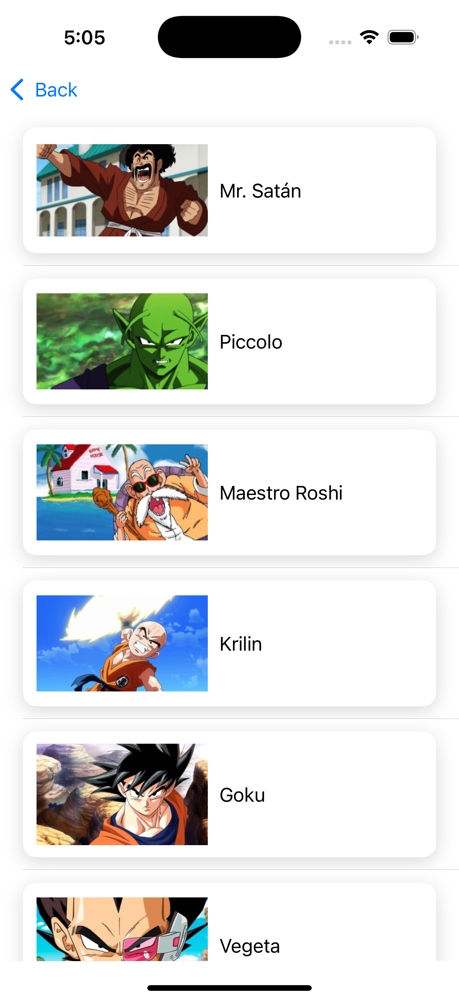

# Dragon Ball Heroes App

An iOS app that displays a list of Dragon Ball heroes, allowing users to view detailed information and transformations for each hero.

## Technologies used:

- Swift
- UIKit
- MVVM architecture
- UINavigationController for navigation using `pushViewController` method
- Asynchronous data loading and error handling

## Features:

- Dynamic list of heroes with images
- Detail screen for individual heroes showing transformations
- Smooth navigation using UINavigationController and programmatic `pushViewController` transitions
- Loading indicators and error messages during network calls

## How to run:

1. Clone the repository
2. Open the project in Xcode 14 or later
3. Run on iOS 14+ simulator or device

## Project status:

Active development

    
    

    
    

